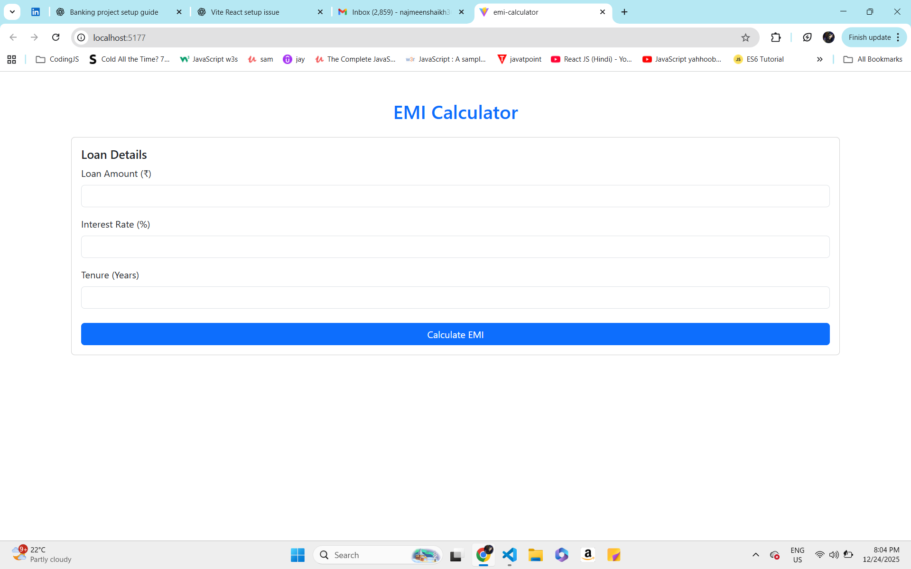
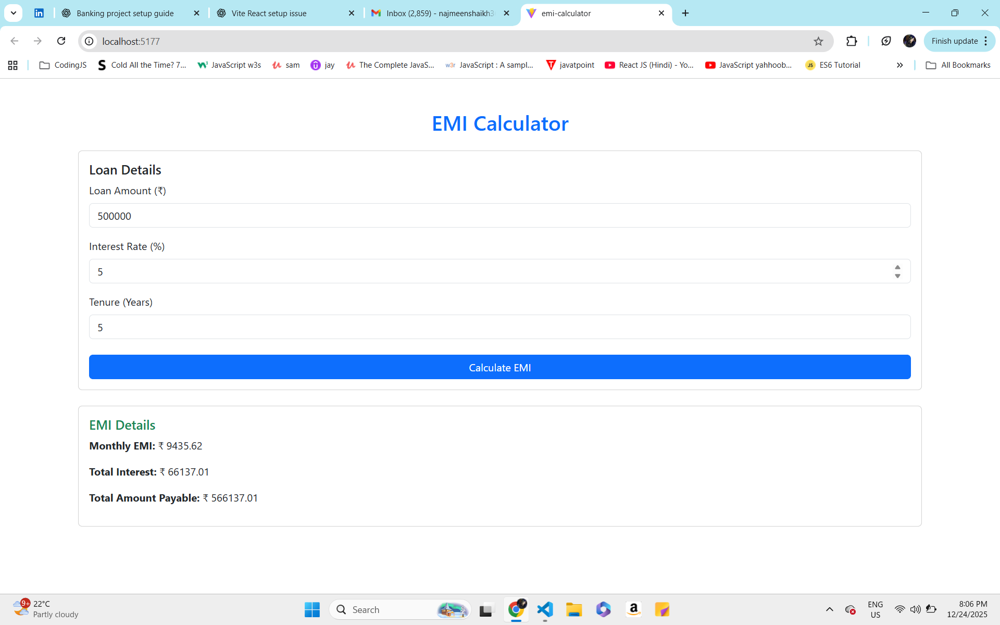

# 🧮 EMI Calculator – React Banking Project

A beginner-friendly **EMI Calculator** built using **React + Vite**, designed with real-world **banking and finance logic**.  
This project demonstrates clean UI, controlled inputs, validation, and financial calculations.

---

## 🚀 Live Features

- Loan Amount input
- Interest Rate input
- Tenure (Years)
- Monthly EMI calculation
- Total Interest Payable
- Total Amount Payable
- Input validation with error handling
- Clean card-based UI (Bootstrap)

---

## 🛠️ Tech Stack

- React (Vite)
- JavaScript (ES6)
- Bootstrap 5
- HTML5 / CSS3

---

## 📸 Screenshots
### 🔹 Validation Error

### 🔹 EMI Form

### 🔹 EMI Calculation Result

---

## 📐 EMI Formula Used
